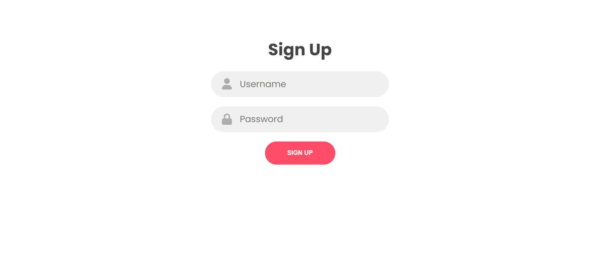
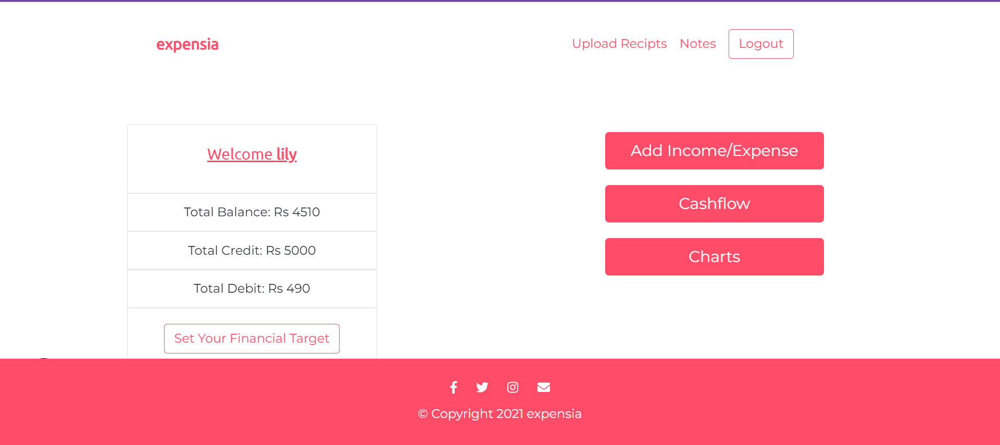
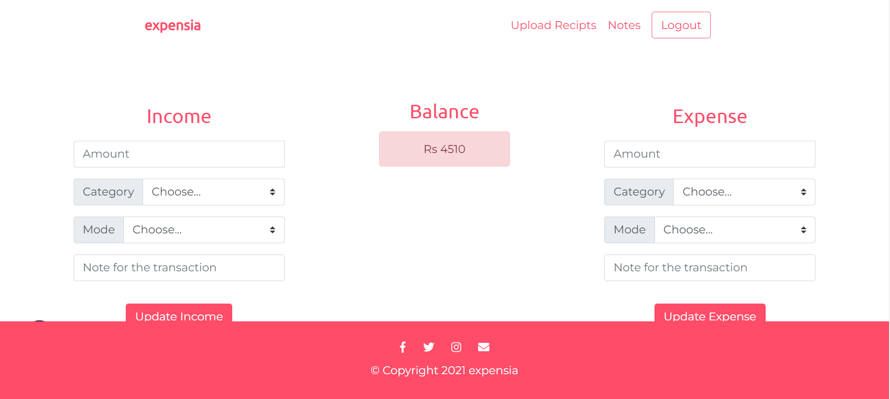
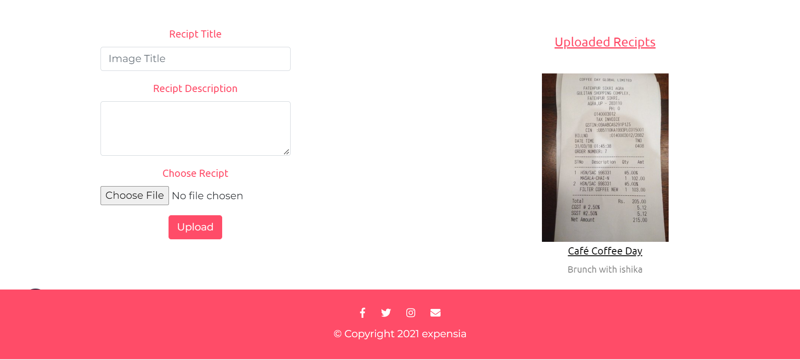
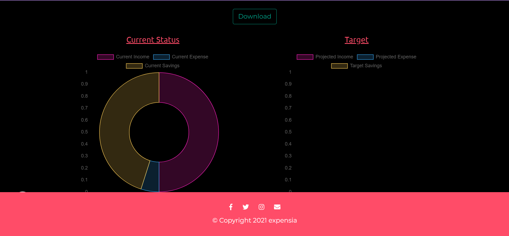
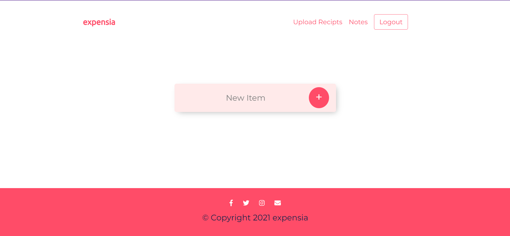

# Expense-Tracker

## Getting Started

It is a expense tracking website, which helps to achive your financial goals.

## Features

- Login/SignUp
- Setting Financial targets for income and expense
- Keep track of your cashflow
- Download Transaction History 
- Visualise your targets in form of charts.
- Download charts for future reference.
- Upload Bill Recipts.
- Notes Section.

## Tech Stack
1. Express
2. MongoDB
3. Ejs
4. BootStrap

---

Website Link: https://intense-ravine-12624.herokuapp.com/

---

  
  

      

  
  

      

  
  

  

  
  

  

  
  

  

  
  

    

  
  

    

  
  

   

  
  

